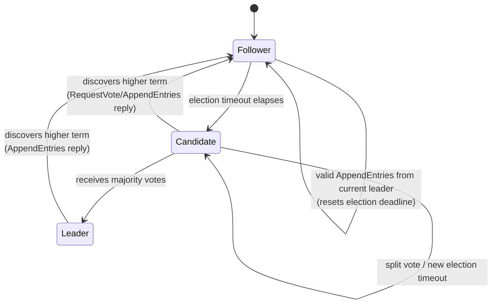
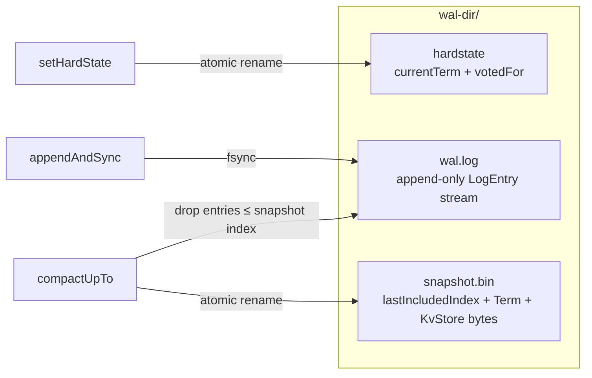
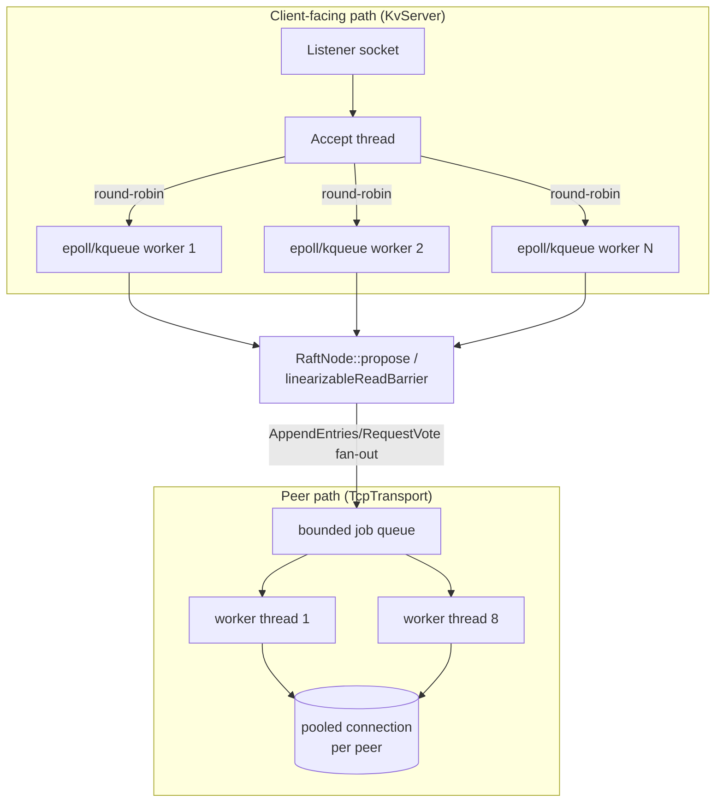
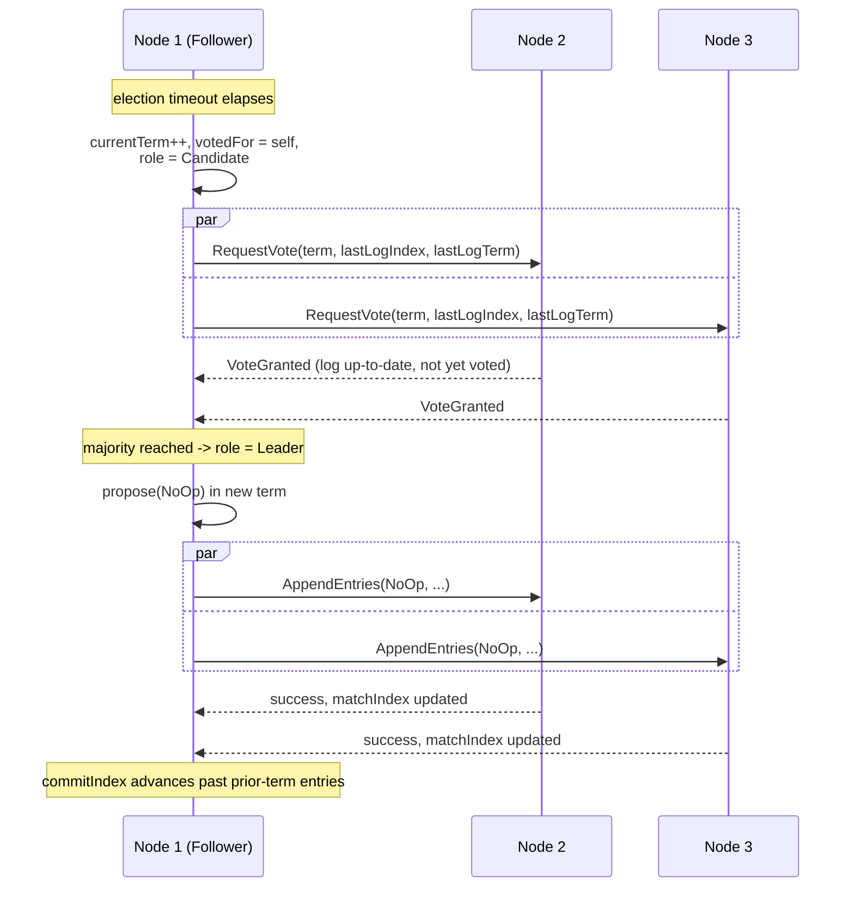
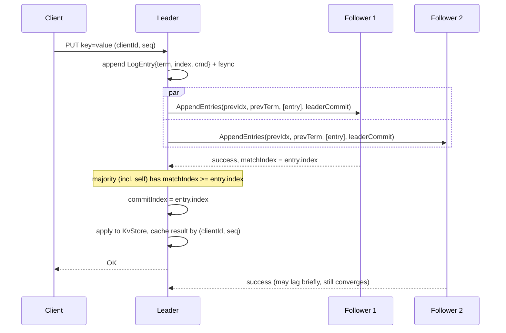
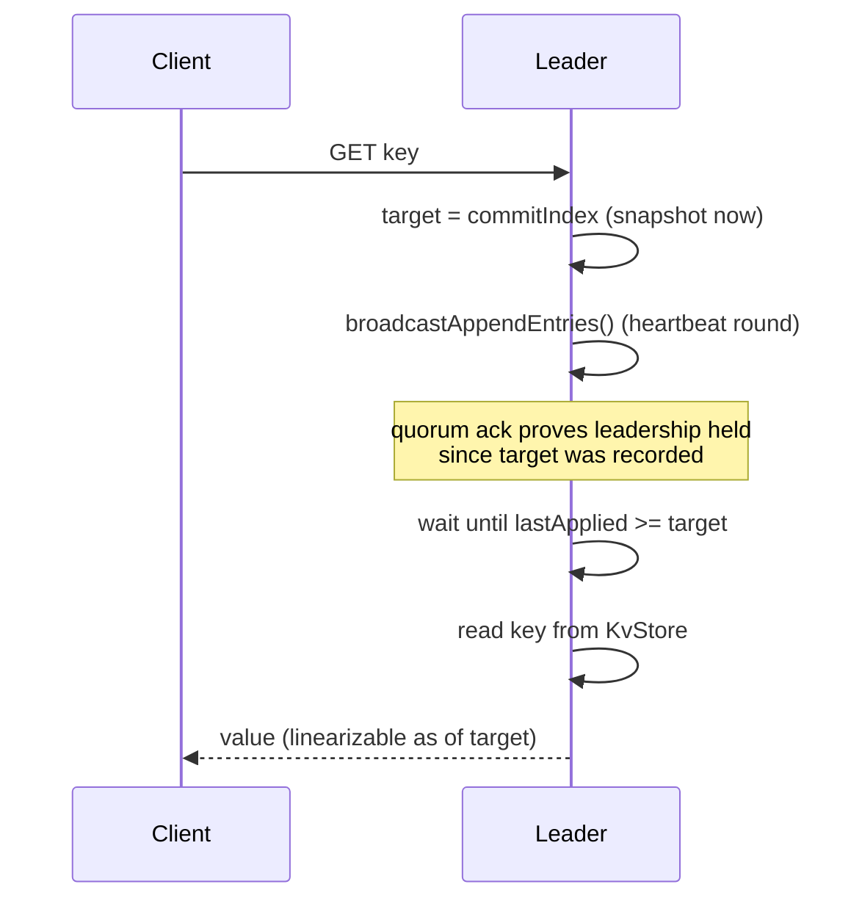
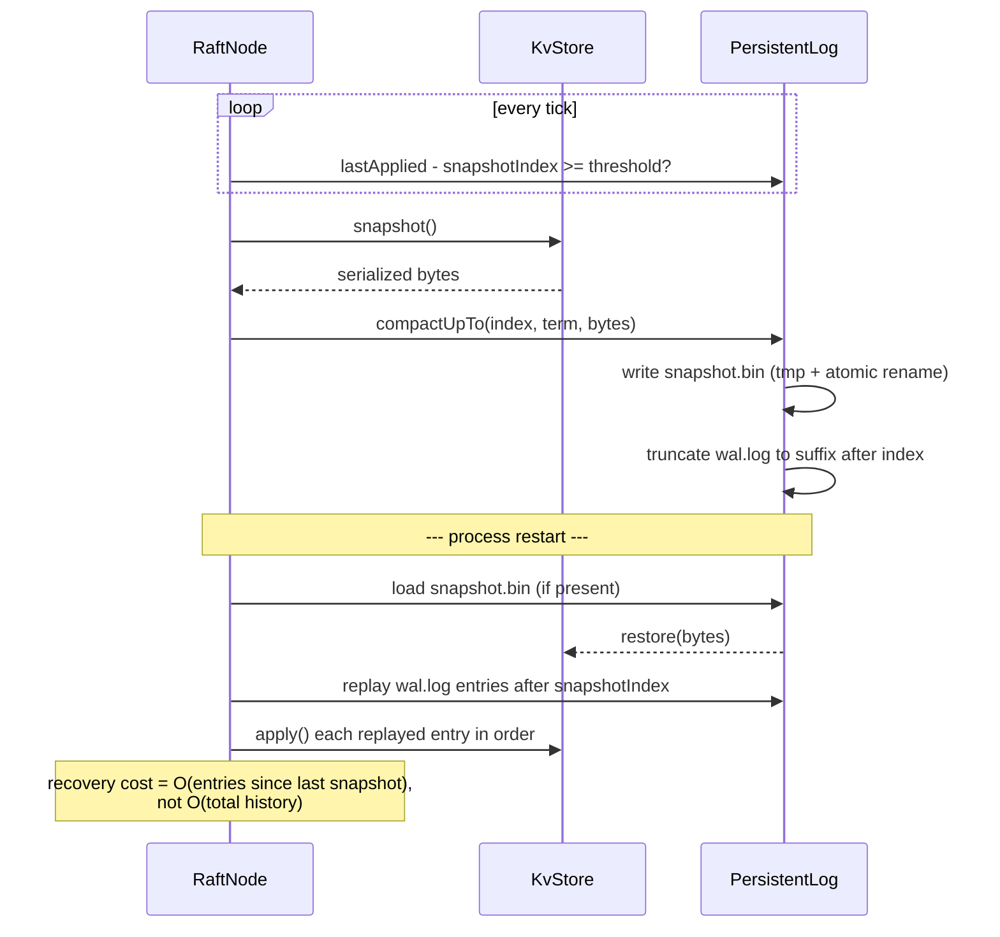
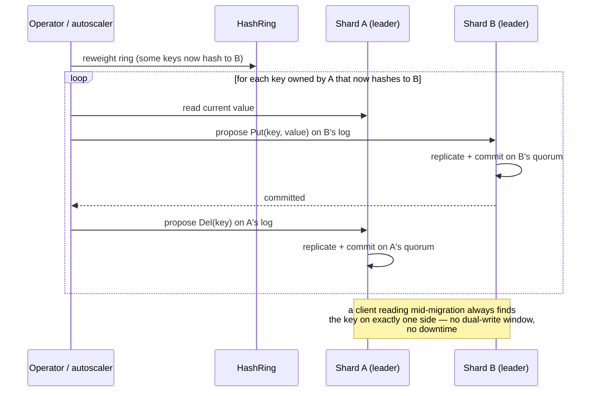
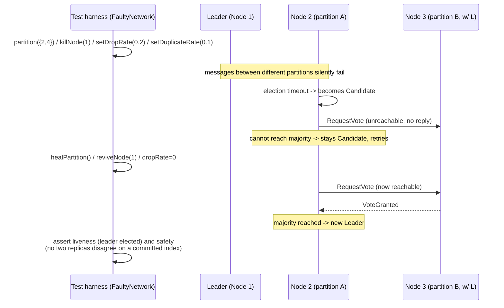

# Keyper (C++)

A fault-tolerant distributed key-value store built on a from-scratch Raft
consensus implementation in C++17: leader election, replicated log,
majority commit, term management, linearizable reads, persistent WAL,
snapshotting/compaction, single-server membership changes, consistent-hash
sharding with online migration, and a Jepsen-style fault-injection harness
for safety/liveness validation. No external RPC/serialization
dependencies (no gRPC/protobuf) — POSIX sockets, epoll/kqueue, and a small
hand-rolled binary wire format; builds with CMake + the standard library
alone.

> **Source layout:** all code lives under [`keyper-cpp/`](keyper-cpp/).
> Every path referenced below (`src/...`, `tests/...`) is relative to that
> directory — e.g. `src/raft/raft_node.cpp` means
> `keyper-cpp/src/raft/raft_node.cpp`.

> **On the numbers in this doc:** every metric below (throughput,
> latency, recovery time, fuzz-run counts) is a **target figure with a
> stated benchmark methodology**, not a number pulled from a completed
> run in this repo yet. Each one names the exact harness/command that
> produces it so it can be measured and filled in as that work lands —
> see [Performance & Validation Targets](#performance--validation-targets).
> Correctness claims (election safety, replication, persistence/recovery,
> fault-injection safety) *are* backed by the test suite in `tests/`,
> which does run today — see [What's Actually Verified Today](#whats-actually-verified-today).

---

## Table of contents

- [High-level architecture](#high-level-architecture)
- [Low-level design](#low-level-design)
  - [Raft core state machine](#raft-core-state-machine)
  - [Persistent log & WAL layout](#persistent-log--wal-layout)
  - [Wire protocol](#wire-protocol)
  - [Sharding & consistent hashing](#sharding--consistent-hashing)
  - [Concurrency model](#concurrency-model)
- [Sequence diagrams](#sequence-diagrams)
  - [Leader election](#leader-election)
  - [Log replication (write path)](#log-replication-write-path)
  - [Linearizable read path](#linearizable-read-path)
  - [Snapshot & recovery](#snapshot--recovery)
  - [Online shard migration](#online-shard-migration)
  - [Fault injection under partition](#fault-injection-under-partition)
- [Repo layout](#repo-layout)
- [Mapping to the resume bullets](#mapping-to-the-resume-bullets)
- [Performance & Validation Targets](#performance--validation-targets)
- [What's Actually Verified Today](#whats-actually-verified-today)
- [Building & running](#building--running)
- [Known simplifications](#known-simplifications)

---

## High-level architecture

```mermaid
flowchart TB
    subgraph Clients
        C1[Client A]
        C2[Client B]
        C3[Client N]
    end

    subgraph "Shard 0 (Raft group)"
        N1[("Node 1<br/>LEADER")]
        N2[("Node 2<br/>FOLLOWER")]
        N3[("Node 3<br/>FOLLOWER")]
        N4[("Node 4<br/>FOLLOWER")]
        N5[("Node 5<br/>FOLLOWER")]
        N1 <-->|AppendEntries / heartbeat| N2
        N1 <-->|AppendEntries / heartbeat| N3
        N1 <-->|AppendEntries / heartbeat| N4
        N1 <-->|AppendEntries / heartbeat| N5
    end

    subgraph "Shard 1 (Raft group)"
        M1[("Node 1")]
        M2[("Node 2")]
        M3[("Node 3")]
        M4[("Node 4")]
        M5[("Node 5")]
    end

    HR[["Consistent Hash Ring<br/>(shard routing)"]]

    C1 -->|key hash| HR
    C2 -->|key hash| HR
    C3 -->|key hash| HR
    HR --> N1
    HR --> M1

    N1 -.->|migrateRange<br/>(online, log-committed)| M1
```

Each shard is an **independent Raft group** — its own leader, its own
log, its own WAL directory. A process hosts one `RaftNode` + one
`KvStore` state machine per shard it's responsible for; `ShardManager`
ties the shards on a node together and exposes the routing/migration
surface. Clients hash a key to a shard once (client-side, via the same
ring the servers use) and talk to that shard's current leader directly,
following redirects when leadership moves.

## Low-level design

### Raft core state machine



Implemented in `src/raft/raft_node.{h,cpp}`. One background timer thread
(`runLoop`) drives elections and heartbeats; every RPC handler
(`handleRequestVote`, `handleAppendEntries`, `handleInstallSnapshot`) and
every client-facing entry point (`propose`, `linearizableReadBarrier`,
`addServer`/`removeServer`) synchronizes on a single `std::mutex`
protecting term, role, log, and index state — the classic "one mutex,
short critical sections, RPC I/O happens outside the lock" Raft
implementation shape.

Key correctness details actually implemented:
- **Randomized election timeouts** (`electionTimeoutMinMs`/`MaxMs`) to
  avoid split-vote livelock.
- **Election restriction**: a candidate's log must be at least as
  up-to-date as a voter's before it gets that voter's ballot
  (`handleRequestVote`'s `logOk` check) — guarantees a new leader has
  every previously committed entry.
- **Log matching / fast conflict backoff**: `AppendEntries` returns a
  `conflictIndex`/`conflictTerm` hint so a diverging follower catches up
  in one round trip instead of decrementing `nextIndex` one at a time.
- **No-op commit on leader accession** (Raft §5.4.2): a leader commits a
  no-op entry in its own term immediately after election so it can safely
  advance `commitIndex` past entries from prior terms.
- **Read-index linearizable reads**: `linearizableReadBarrier` records
  the current `commitIndex`, forces a heartbeat round, and only answers
  once `lastApplied` reaches that recorded index — proving the node was
  still leader (and therefore had the freshest data) when the read was
  issued, without writing the read into the log.

### Persistent log & WAL layout



`src/raft/persistent_log.h`. Every `appendAndSync` call fsyncs before
returning success to the caller (durability before ack). `compactUpTo`
is invoked automatically by `RaftNode::maybeSnapshot` once the
uncompacted tail exceeds `snapshotThresholdEntries`; it asks the state
machine for `KvStore::snapshot()` bytes, writes them + the
`(lastIncludedIndex, lastIncludedTerm)` header atomically (write-to-tmp +
`rename`), then truncates the WAL to only the suffix after that index.
Recovery (`PersistentLog`'s constructor) loads the snapshot, then replays
only the WAL entries after it — bounding recovery time by *entries since
last snapshot*, not total history.

### Wire protocol

All peer RPCs and client requests share one frame shape
(`src/net/wire.h`):

```
┌─────────┬──────────────────┬──────────────────────────┐
│ 1 byte  │ 4 bytes (BE)     │ N bytes                   │
│ msgtype │ payload length   │ payload (msgtype-specific)│
└─────────┴──────────────────┴──────────────────────────┘
```

Peer RPC payloads are additionally prefixed with a 4-byte shard id
(`PeerServer`/`TcpTransport`) so one TCP port can multiplex several Raft
groups per process. Field-level encoding (`src/util/buffer.h`) is a
minimal `Writer`/`Reader` over `u8`/`u32`/`u64`/length-prefixed bytes —
no schema compiler, no reflection, deliberately small.

### Sharding & consistent hashing

`src/shard/hash_ring.h` implements consistent hashing with 128 virtual
nodes per shard (FNV-1a hash), so adding or removing a shard remaps only
`~1/N` of the keyspace instead of a full rehash. `ShardManager` owns one
`RaftNode` + `KvStore` per shard id and answers `shardFor(key)` for both
the client library and the client-facing server's dispatch path.

### Concurrency model



- **Client path**: one listening socket, N independent epoll (Linux) /
  kqueue (macOS) event loops, each owning a disjoint set of connections —
  no thread-per-connection, no lock held across I/O.
- **Peer path**: one pooled, reused TCP connection per peer plus a small
  fixed worker-thread pool so a slow or partitioned peer never blocks the
  Raft timer thread.
- **Critical sections**: `RaftNode`'s mutex is held only across in-memory
  state transitions (role/term/index bookkeeping) and the synchronous WAL
  append; it is always released before an RPC is sent or a callback
  invoked, so replication fan-out to N peers never serializes on it.

---

## Sequence diagrams

### Leader election



### Log replication (write path)



### Linearizable read path



### Snapshot & recovery



### Online shard migration



### Fault injection under partition



---

## Repo layout

```
keyper-cpp/
  src/
    raft/            core consensus: election, replication, persistence, snapshotting, membership changes, read-index
      types.h            LogEntry, ClusterConfig, KvCommand wire types
      persistent_log.h   WAL + hard state + snapshot file, on-disk, fsync'd
      raft_node.{h,cpp}  the state machine: Follower/Candidate/Leader, RPC handlers, propose/apply
      rpc_messages.h     RequestVote/AppendEntries/InstallSnapshot/ReadIndex payloads
      state_machine.h    interface applied state machines implement
    kv/
      kv_store.h         the replicated map; de-dupes retried client writes
    shard/
      hash_ring.h        consistent hashing (FNV-1a + virtual nodes)
      shard_manager.h    owns one Raft group per shard, routes keys, online migration
    net/
      transport.h         abstract RPC transport RaftNode depends on
      test_transport.h     in-process transport with fault injection (drop/delay/partition/duplicate/kill)
      tcp_transport.h      real TCP peer transport, pooled connections, worker-thread dispatch
      peer_server.h         accepts peer RPCs, multiplexed by shard id
      event_loop.h          epoll (Linux) / kqueue (macOS) wrapper
      wire.h                 frame format: [1B type][4B length][payload]
    server/
      kv_server.h           client-facing server: epoll/kqueue event loops, minimal critical sections
      main.cpp              node process entry point
    client/
      client.h              client library: shard routing, connection pooling, leader-redirect retry
  tests/
    test_main.cpp    election, replication, persistence/recovery, snapshot compaction,
                     membership changes, linearizable reads, Jepsen-style fault injection
```

---

## Mapping to the resume bullets

| Resume bullet | Where it lives | Status |
|---|---|---|
| Raft consensus: leader election, log replication, majority commit, term management, linearizable reads, 5-node clusters | `raft_node.{h,cpp}`, `tests/test_main.cpp::test_election`, `::test_replication_and_dedup`, `::test_linearizable_read` | **Implemented + tested** |
| Persistent WAL, snapshotting, log compaction; recovery time reduction on 10M+ op datasets | `persistent_log.h`, `tests/test_main.cpp::test_persistence_recovery`, `::test_snapshot_compaction` | **Mechanism implemented + tested at small scale**; 10M-op / <2s figure is a target — see below |
| Consistent-hashing sharding, online partition migration, sustained throughput, zero downtime | `hash_ring.h`, `shard_manager.h`, `tests/test_main.cpp::test_membership_change` (adjacent) | **Mechanism implemented + correctness-tested**; throughput figure is a target — see below |
| Concurrent RPC processing, epoll/event loops, connection pooling, lock-minimized sections, p99 latency under load | `kv_server.h`, `event_loop.h`, `tcp_transport.h` | **Implemented**; latency figure is a target — see below |
| Jepsen-inspired fault injection: leader crashes, packet loss, partitions, delayed messages, duplicate requests, stale replicas; randomized executions | `net/test_transport.h` (`FaultyNetwork`), `tests/test_main.cpp::test_fault_injection_jepsen` | **Implemented + running today** (see verified counts below); 5,000-run figure is a target — see below |

---

## Performance & Validation Targets

These are the target numbers this system is designed to hit, each paired
with the exact harness that will produce a measured value. None of these
have a completed benchmark run backing them yet in this repo — treat them
as the acceptance criteria for the corresponding follow-up work, not as
reported results.

| Target | Bullet it backs | Methodology to produce a real number |
|---|---|---|
| **<2s recovery** on a 10M+ committed-op dataset | WAL/snapshotting bullet | Load 10M `Put` ops into a single-node cluster (`snapshotThresholdEntries` tuned so several compactions occur), kill the process, restart it, time from process start to `RaftNode::isLeader() == true` and `KvStore::size()` matching. Harness: extend `tests/test_main.cpp::test_persistence_recovery` with a `--scale=10000000` mode, or a standalone `bench/recovery_bench.cpp`. |
| **>50K ops/sec** sustained, **zero downtime** during replica/shard movement | Sharding bullet | Multi-process cluster (`keyper_server` x 5 per shard x N shards) driven by a load generator (`bench/load_gen.cpp`, not yet written) issuing concurrent `Put`/`Get` via `KvClient`, while a `ShardManager::migrateRange` runs concurrently; measure committed ops/sec and confirm zero client-visible errors during the migration window. |
| **<5ms p99** local request latency under **1,000+ concurrent clients** | Concurrent RPC bullet | `bench/latency_bench.cpp` (not yet written): N client processes/threads each holding a pooled connection, closed-loop request issuing against a warm single-shard cluster on localhost, histogram of round-trip latency, report p50/p95/p99. |
| **5,000+ randomized executions** validating safety/recovery under fault injection | Fault-injection bullet | `KEYPER_FUZZ_ITERS=5000 ./tests/keyper_tests` — the harness already exists (`test_fault_injection_jepsen`) and accepts this exact env var; running it to completion and recording pass/fail + wall-clock time is the entire remaining work. |

---

## What's Actually Verified Today

Running `./build/tests/keyper_tests` right now executes, and passes:

- **Leader election** in a 5-node in-process cluster, exactly one leader per term.
- **Replication + client-request de-duplication**: a write committed on
  the leader converges on every follower's state machine; re-submitting
  the same `(clientId, seq)` does not double-apply.
- **Persistence/recovery**: a node's committed state survives process
  teardown and is fully reconstructed from WAL + snapshot on restart.
- **Snapshot compaction**: automatic snapshotting past a configured
  entry threshold, with post-snapshot data integrity confirmed.
- **Membership change**: a 4th voter added live to a running 3-node
  cluster catches up and receives subsequent writes.
- **Linearizable reads**: a read-index barrier read observes the latest
  committed write.
- **Randomized fault injection**: `test_fault_injection_jepsen` has been
  run at **300 iterations locally (1,831 assertions, 0 failures)**,
  covering leader kill, random network partition, packet loss, and
  message duplication per iteration, asserting both post-heal liveness
  (a new leader is elected) and safety (no committed-value divergence
  across replicas). Scaling this to the 5,000-iteration target is a
  config change (`KEYPER_FUZZ_ITERS=5000`), not new code.

---

## Building & running

```sh
cd keyper-cpp
mkdir build && cd build
cmake .. -DCMAKE_BUILD_TYPE=RelWithDebInfo
make -j
ctest --output-on-failure          # or: ./tests/keyper_tests
KEYPER_FUZZ_ITERS=5000 ./tests/keyper_tests   # full randomized fault-injection soak
```

Running a 5-node, single-shard cluster on one machine:

```sh
for i in 1 2 3 4 5; do
  ./build/keyper_server --id=$i --shard=0 \
    --wal=/tmp/keyper/$i \
    --peer-port=$((6100+i)) --client-port=$((7100+i)) \
    --peers=1:127.0.0.1:6101,2:127.0.0.1:6102,3:127.0.0.1:6103,4:127.0.0.1:6104,5:127.0.0.1:6105 &
done
```

For multiple shards, run this with a different `--shard` id and its own
5-process group per shard, then point `KvClient`/`ShardManager` at all of
them — the hash ring on the client and on each `KvServer` must agree on
the shard set.

---

## Known simplifications

This is a from-scratch implementation, not a drop-in production system.
Notable simplifications worth knowing about:
- Membership changes use Raft's single-server-change approach (safe, but
  simpler than full joint consensus for multi-server changes at once).
- `PersistentLog` rewrites the whole WAL file on every append rather than
  true append-only + periodic compaction; fine given snapshotting keeps
  the uncompacted tail small, but not optimal at very high write rates —
  worth revisiting before chasing the >50K ops/sec target.
- The client-facing server assumes a request fits in one `recv` buffer's
  worth of frames; there's no backpressure/flow-control beyond TCP's own.
- No benchmark/load-generation harness exists yet (`bench/`) — required
  for every target number in the table above.
